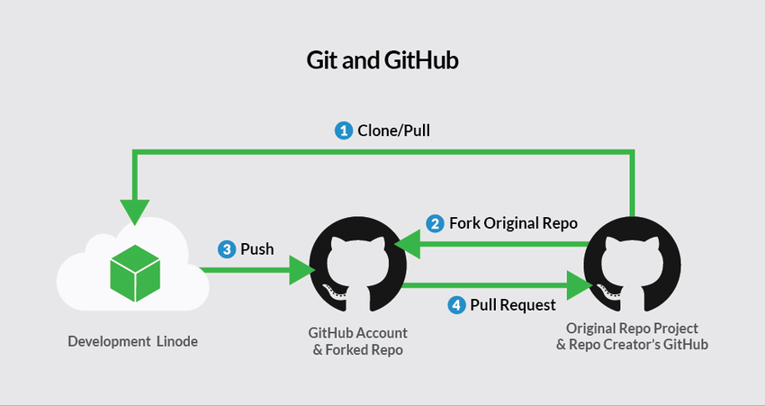

# Git and GitHub Cheat Sheet



## Git Basics

### Configuration

```bash
# Set global username
git config --global user.name "Your Name"

# Set global email
git config --global user.email "your.email@example.com"

# Check current configuration
git config --list
```

### Repository Initialization

```bash
# Initialize a new Git repository
git init

# Clone an existing repository
git clone <repository-url>
```

### Basic Commands

```bash
# Check the status of your repository
git status

# Add files to the staging area
git add <file>
git add .  # Add all files

# Commit changes
git commit -m "Commit message"

# View commit history
git log

# View a specific commit
git show <commit-hash>
```

### Branching and Merging

```bash
# Create a new branch
git branch <branch-name>

# Switch to a branch
git checkout <branch-name>

# Create and switch to a new branch
git checkout -b <branch-name>

# Merge a branch into the current branch
git merge <branch-name>

# Delete a branch
git branch -d <branch-name>
```

### Remote Repositories

```bash
# Add a remote repository
git remote add origin <repository-url>

# List remote repositories
git remote -v

# Fetch changes from the remote repository
git fetch origin

# Pull changes from the remote repository
git pull origin <branch-name>

# Push changes to the remote repository
git push origin <branch-name>

# Remove a remote repository
git remote remove <remote-name>
```

### Stashing Changes

```bash
# Save changes to a stash
git stash

# List stashes
git stash list

# Apply the most recent stash
git stash apply

# Drop a stash
git stash drop <stash@{n}>
```

### Rebasing

```bash
# Rebase the current branch onto another branch
git rebase <branch-name>

# Continue a rebase after resolving conflicts
git rebase --continue

# Abort the rebase
git rebase --abort
```

## Points To Remember

### Repository Management

```bash
# Fork a repository from GitHub website

# Navigate to the repository page and click "Fork"

# Create a new repository on GitHub website

# Navigate to GitHub and click "New Repository"
```

### Collaboration

```bash
# Create a pull request on GitHub website

# Navigate to the "Pull Requests" tab and click "New Pull Request"

# Merge a pull request on GitHub website

# Review the pull request and click "Merge Pull Request"
```
